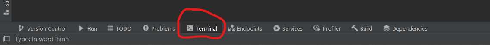
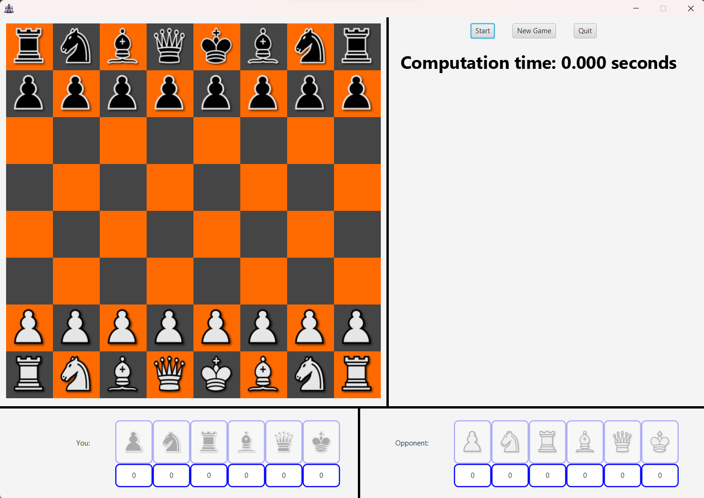
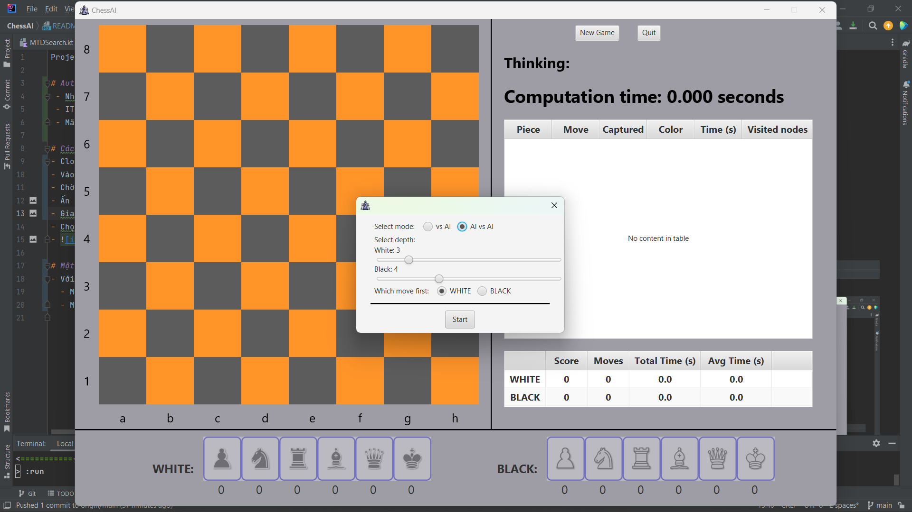
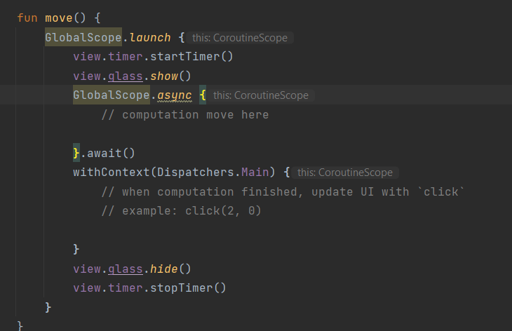

Project AI - ChessAI

# Cách chạy project:
- Clone về máy, mở bằng `IntelliJ IDEA`
- Vào `File -> Project Structure` để chỉnh thư viện và JDK nếu `IntelliJ IDEA` ko tự động nhận
- Ấn tab `Terminal` ở dưới màn hình: 
- Chạy lệnh `$ ./gradlew run`
- 
- Chọn `Start` để chọn chế độ và bắt đầu chơi
- 

# Cách thêm code phần thuật toán vào Project:
- Package chứa phần thuật toán: `algorithm`
- Cập nhật nước đi của AI ở hàm `move` của file `objects/Player.kt`
- 
