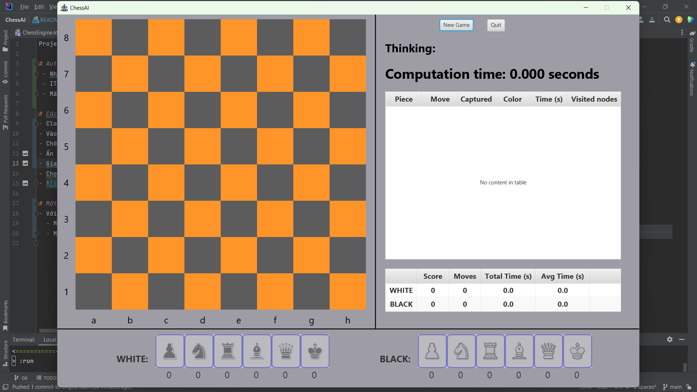
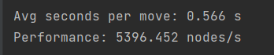

Project AI - ChessAI

# Author:
 - Nhóm 6
 - IT 3160 - Nhập môn Trí tuệ nhân tạo
 - Mã lớp: 136801

# Cách chạy project:
- Clone project về máy, mở bằng `IntelliJ IDEA`
- Vào `File -> Project Structure` để chỉnh thư viện và JDK nếu (JDK 16+)
- Chờ IDE load các dữ liệu cần thiết
- Ấn tab `Terminal` ở dưới màn hình và chạy lệnh `$ ./gradlew run` 
- Giao diện bắt đầu của game : 
- Chọn `New Game` để chọn chế độ và bắt đầu chơi
- 

# Một số kết quả
Sau khi thực hiện 30 nước đi:
- Với độ sâu 3:
  - MTD(f): 
  - 
  - Minimax + Alpha-Beta: 
  - 
- Với độ sâu 4:
  - MTD(f): 
  - Minimax + Alpha-Beta: 
- Với độ sâu 5:
  - MTD(f): 
  - Minimax + Alpha-Beta: 
- Với độ sâu 6:
  - MTD(f): 
  - Minimax + Alpha-Beta: rất lâu

